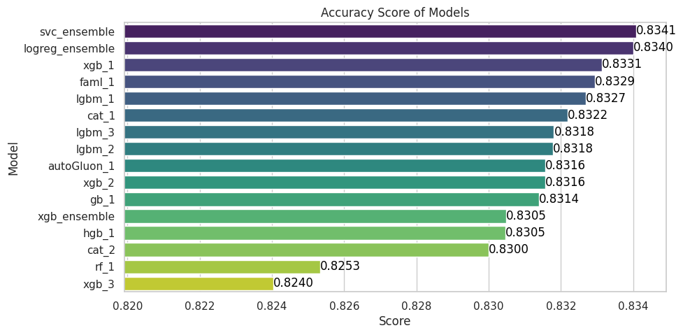

# Objective #
Our main objective is to predict the educational outcome of students based on various demographic, socio-economic, and academic features. Understanding these outcomes is essential for improving educational strategies and policies. We'll explore and compare different classification algorithms to effectively predict whether a student will graduate, drop out, or remain enrolled, and gain insights into the factors influencing these educational pathways.

# Strategy #
The strategy guiding this competition will be to develop several strong, distinct classifiers and then create an even stronger classifier by ensembling them. Various techniques will be applied to achieve the best possible ensemble classifier.

# Structure #
The repository structure is designed to facilitate the development of ensemble strategies.

```bash
.
.
├── base_line.ipynb
├── ensemble.ipynb
├── models
│   ├── autoGluon_1
│   │   ├── model.ipynb
│   │   ├── oof
│   │   │   ├── fold_1.csv
│   │   │   ├── fold_2.csv
│   │   │   ├── fold_3.csv
│   │   │   ├── fold_4.csv
│   │   │   └── fold_5.csv
│   │   └── test
│   │       └── test_pred.csv
│   ├── cat_1
│   │   ├── catboost_info
│   │   │   ├── catboost_training.json
│   │   │   ├── learn
│   │   │   │   └── events.out.tfevents
│   │   │   ├── learn_error.tsv
│   │   │   ├── time_left.tsv
│   │   │   └── tmp
│   │   │       └── cat_feature_index.93626ba3-fee947b5-2167c5b8-877fb713.tmp
│   │   ├── model.ipynb
│   │   ├── oof
│   │   │   ├── fold_1.csv
│   │   │   ├── fold_2.csv
│   │   │   ├── fold_3.csv
│   │   │   ├── fold_4.csv
│   │   │   └── fold_5.csv
│   │   └── test
│   │       └── test_pred.csv
│   ├── cat_2
│   │   ├── catboost_info
│   │   │   ├── catboost_training.json
│   │   │   ├── learn
│   │   │   │   └── events.out.tfevents
│   │   │   ├── learn_error.tsv
│   │   │   ├── time_left.tsv
│   │   │   └── tmp
│   │   ├── model.ipynb
│   │   ├── oof
│   │   │   ├── fold_1.csv
│   │   │   ├── fold_2.csv
│   │   │   ├── fold_3.csv
│   │   │   ├── fold_4.csv
│   │   │   └── fold_5.csv
│   │   └── test
│   │       └── test_pred.csv
│   ├── faml_1
│   │   ├── model.ipynb
│   │   ├── oof
│   │   │   ├── fold_1.csv
│   │   │   ├── fold_2.csv
│   │   │   ├── fold_3.csv
│   │   │   ├── fold_4.csv
│   │   │   └── fold_5.csv
│   │   ├── output.txt
│   │   ├── pss4e6-flaml-roc-auc-ovo.ipynb
│   │   └── test
│   │       └── test_pred.csv
│   ├── gb_1
│   │   ├── model.ipynb
│   │   ├── oof
│   │   │   ├── fold_1.csv
│   │   │   ├── fold_2.csv
│   │   │   ├── fold_3.csv
│   │   │   ├── fold_4.csv
│   │   │   └── fold_5.csv
│   │   ├── s04e06-academic-success-voting.ipynb
│   │   └── test
│   │       └── test_pred.csv
│   ├── hgb_1
│   │   ├── model.ipynb
│   │   ├── oof
│   │   │   ├── fold_1.csv
│   │   │   ├── fold_2.csv
│   │   │   ├── fold_3.csv
│   │   │   ├── fold_4.csv
│   │   │   └── fold_5.csv
│   │   └── test
│   │       └── test_pred.csv
│   ├── lgbm_1
│   │   ├── model.ipynb
│   │   ├── oof
│   │   │   ├── fold_1.csv
│   │   │   ├── fold_2.csv
│   │   │   ├── fold_3.csv
│   │   │   ├── fold_4.csv
│   │   │   └── fold_5.csv
│   │   └── test
│   │       └── test_pred.csv
│   ├── lgbm_2
│   │   ├── model.ipynb
│   │   ├── oof
│   │   │   ├── fold_1.csv
│   │   │   ├── fold_2.csv
│   │   │   ├── fold_3.csv
│   │   │   ├── fold_4.csv
│   │   │   └── fold_5.csv
│   │   └── test
│   │       └── test_pred.csv
│   ├── lgbm_3
│   │   ├── model.ipynb
│   │   ├── oof
│   │   │   ├── fold_1.csv
│   │   │   ├── fold_2.csv
│   │   │   ├── fold_3.csv
│   │   │   ├── fold_4.csv
│   │   │   └── fold_5.csv
│   │   └── test
│   │       └── test_pred.csv
│   ├── rf_1
│   │   ├── model.ipynb
│   │   ├── oof
│   │   │   ├── fold_1.csv
│   │   │   ├── fold_2.csv
│   │   │   ├── fold_3.csv
│   │   │   ├── fold_4.csv
│   │   │   └── fold_5.csv
│   │   └── test
│   │       └── test_pred.csv
│   ├── xgb_1
│   │   ├── model.ipynb
│   │   ├── oof
│   │   │   ├── fold_1.csv
│   │   │   ├── fold_2.csv
│   │   │   ├── fold_3.csv
│   │   │   ├── fold_4.csv
│   │   │   └── fold_5.csv
│   │   └── test
│   │       └── test_pred.csv
│   ├── xgb_2
│   │   ├── academic-success-eda-xgb-catb.ipynb
│   │   ├── model.ipynb
│   │   ├── oof
│   │   │   ├── fold_1.csv
│   │   │   ├── fold_2.csv
│   │   │   ├── fold_3.csv
│   │   │   ├── fold_4.csv
│   │   │   └── fold_5.csv
│   │   └── test
│   │       └── test_pred.csv
│   └── xgb_3
│       ├── model.ipynb
│       ├── oof
│       │   ├── fold_1.csv
│       │   ├── fold_2.csv
│       │   ├── fold_3.csv
│       │   ├── fold_4.csv
│       │   └── fold_5.csv
│       └── test
│           └── test_pred.csv
├── README.md
├── src
│   ├── test
│   │   ├── sample_submission.csv
│   │   └── test.csv
│   └── train
│       ├── original.csv
│       └── train.csv
└── submission

```

Each individual model should have its respective folder within the models/ directory. Inside the individual model's folder, there should be a script that generates the out-of-fold predictions, which will be used in the ensemble training. Note also that there are no EDA notebooks here, as many people have already dedicated themselves to this task in the Kaggle competition itself. It is a good source of information and understanding of the data. Of course, if needed, there will be advances in this regard here.

# How It Works #
The training dataset was divided into 5 folds. A cross-validation strategy was used to evaluate each model. Additionally, the out-of-fold predictions were saved to robustly evaluate ensemble strategies and assist in hyperparameter tuning.

# Ensemble techniques #
Several ensemble techniques were developed and are detailed below.

## Stacking ##

### Logistic Regression ###
The predictions of various individual classifiers are used as features to train a second model, here a logistic regression model. The goal of stacking is to combine the strengths of different classifiers to improve the predictive performance of the final model.

### XGBClassifier ###
Similar to the logistic regression approach, but using a more complex model which very likely will lead to overfitting.

## Voting Classifiers ##

### Soft Voting ###
Each base classifier provides a probability for each class, and these probabilities are weighted and summed. The class with the highest sum of probabilities is chosen as the final prediction.

# Feature Selection and Hyperparameter Tuning #
Simply adding infinitely many individual models, even if they are good models, will not improve the final ensemble indefinitely. Some diversity between them is also necessary. Thus, it is essential to select the best subset of models (in this context, features) to ensure good ensemble performance. For this task, we used a simple strategy with Optuna, which was also used for hyperparameter tuning of each model as well as for the ensemble models.

The best subset of models selected by me:
```
['lgbm_1', 'xgb_2', 'xgb_1', 'autoGluon_1', 'cat_2', 'cat_1']
```

# Scores #
Score here refers to accuracy.

## Validation Set ##



## Kaggle ##


Fortunately, I achieved a top 33 ranking out of 2684 teams in the competition. =]